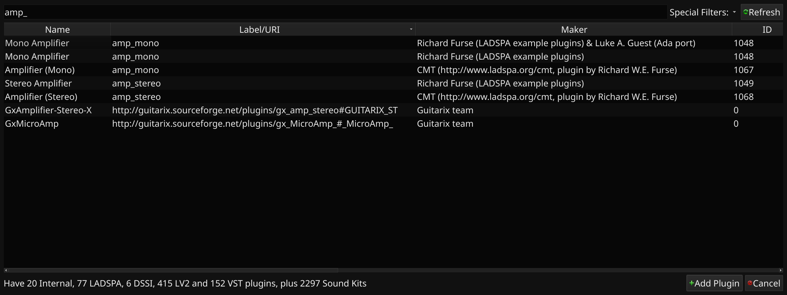

# APlug

Port of the LADSPA 1.1.1 API for Ada 2012. Doesn't do much at this time but does show up in Carla.



Currently, this is quite hacky and uses a bunch of ```System.Address``` types to get around some of the problems. I'm not sure how to go about creating a nicer API. The biggest issues are around the array types for the ```LADSPA.All_Port_Descriptors``` whereby I use an enumeration and subtype this for the mono amplifier controls. In C, they just create an enum with all the values in, but then they don't need any type checking so can do whatever they like. In Ada, it's much more difficult. Generics wouldn't solve the problem in quite the right way, i.e. I wouldn't be able to have multiple descriptors working if I used generics as it would constrain the whole package a bit too much.

# Building

## GNAT

```bash
$ git clone git@github.com:Lucretia/aplug.git
$ cd aplug/build/gnat
$ gprbuild -P amp.gpr -p
```

# Dependencies

Ada 2012 compiler.

## Tested with

FSF GNAT 9.2.0

# Copyright

Copyright (C) 2019 by Luke A. Guest

# Licence

New-style BSD, see LICENCE file in source root directory and at the start of all source files.
